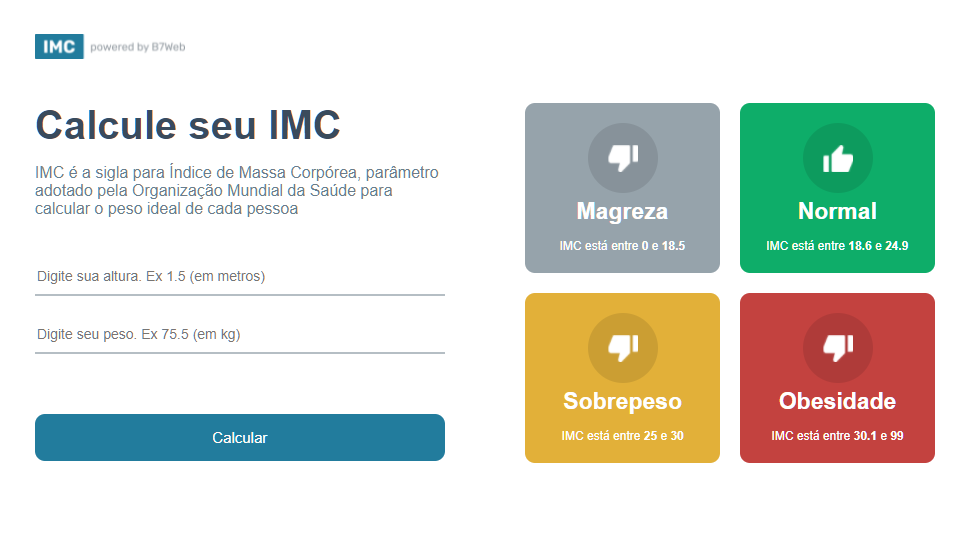
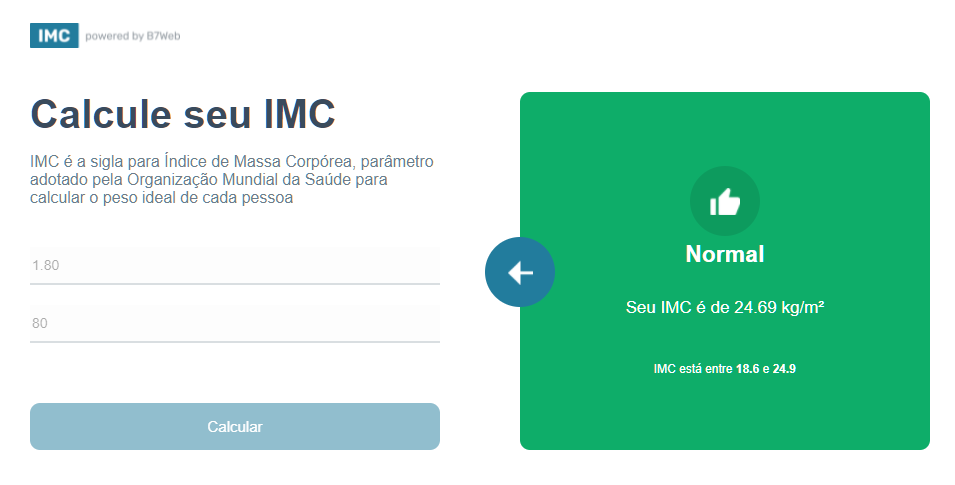

# Calculadora de IMC 

Projeto em React + TypeScript construindo uma calculadora de IMC.

Projeto desenvolvido com intuito de estudo, durante o curso de formação FullStack <strong> B7Web </strong>.

 

## Screenshot

 

 

 

### Instalação 

- `npm install`

### Para rodar
- `npm start`

